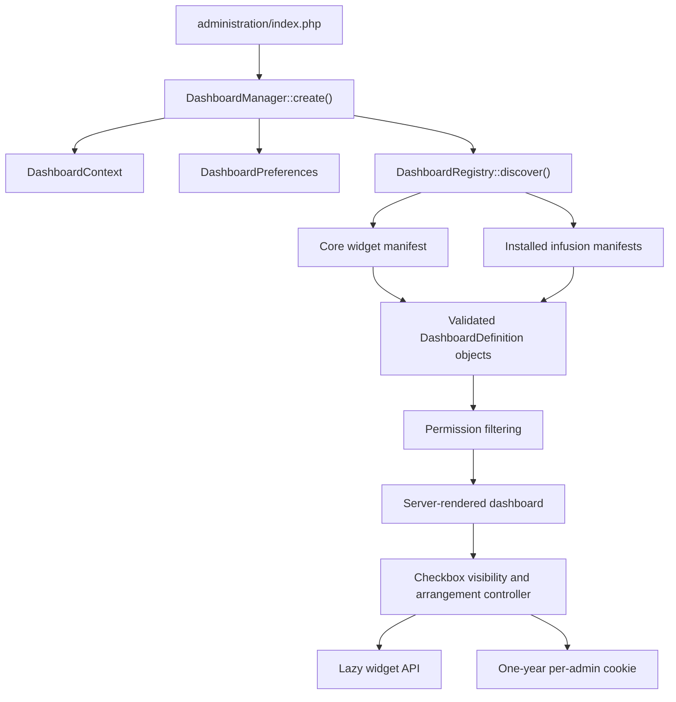

# Core Framework & Administration Dashboard System Specification

> UI framework engine ownership has been separated into `documentation/phpfusion/ui-framework-engine.md`, which is the current master reference for selection, manifests, boot, assets, component dispatch, CSS translation, and browser compatibility. This document remains the administration-dashboard architecture reference and high-level integration overview.

**Status:** Implemented in the PHPFusion core as of 2026-08-01.

This document serves as the master technical architecture reference for the **entire CMS framework** and its **Administration Dashboard System**. Read this document before modifying system-wide layout logic, CSS/UI engine integration, theme presentation layers, dashboard discovery, widgets, preferences, or localization routing.

The narrower widget-authoring guide remains at `documentation/sdk/admin-dashboard.md`.

---

## 1. System-Wide Multi-Framework UI Engine Architecture

The CMS utilizes a **multi-framework abstraction engine** designed to decouple server-rendered components, widgets, and core HTML from specific frontend CSS libraries (such as Bootstrap 5 or Tailwind CSS).

```
                      +---------------------------------------+
                      |         Active Admin/Site Theme       |
                      +---------------------------------------+
                                          |
                        Declares Framework Preference & Colors
                                          |
                                          v
                      +---------------------------------------+
                      |      Multi-Framework Engine Core       |
                      +---------------------------------------+
                                 /                 \
                                /                   \
             Theme: 'bs5'      /                     \     Theme: 'tailwind'
                              v                       v
            +--------------------+                 +--------------------+
            | Load BS5 CSS, JS,  |                 | Load Tailwind CSS  |
            | & Translations     |                 | Asset Bundle Only  |
            +--------------------+                 +--------------------+
                              |                       |
                              +-----------+-----------+
                                          |
                                          v
                      +---------------------------------------+
                      |      Dynamic CSS Class Resolver       |
                      |         framework_css('col-xl-12')    |
                      +---------------------------------------+
                                          |
                        +-----------------+-----------------+
                        |                                   |
              BS5 Mapping Mode                     Tailwind Mapping Mode
              Returns: "col-xl-12"                 Returns: "tw-col-xl-12"
                        |                                   |
                        +-----------------+-----------------+
                                          |
                                          v
                      +---------------------------------------+
                      |       Theme Palette Overlay           |
                      |   Injects CSS Variables & Color Rules |
                      +---------------------------------------+
```

### Architectural Principles

1. **Entire System Scope:** The architectural decisions, framework mapping rules, and theme-neutral component strategies detailed here apply across the **entire PHPFusion ecosystem** (core modules, infusions, layout managers, and admin panels)—not just the administration dashboard.
2. **Framework Switching & Class Mapping:**
    * **Bootstrap 5 (BS5) Base:** BS5 serves as the default baseline framework. When a theme explicitly declares itself as `bs5`, the core engine pulls in the complete BS5 scripts, stylesheets, and structural translations.
    * **Tailwind CSS Engine:** When a theme declares itself as `tailwind`, the engine suppresses BS5 assets and loads only the Tailwind CSS engine bundle.
    * **Optional server-side abstraction via `framework_css()`:** Core renderers may translate known structural classes before delivery when that is useful, but community templates are not required to wrap their markup:
      ```php
      echo "<div class='".framework_css('col-xl-12')."'>";
      ```
    * **Browser framework bridge:** The Tailwind engine preserves community-authored Bootstrap/Tabler, Bulma, Foundation, and custom classes, then adds canonical `tw-*` aliases through DOM APIs and a batched `MutationObserver`. It does not regex-rewrite the full server response. See `documentation/framework-bridge/README.md`.
3. **Decoupled Theme Color Stacking:**
    * Framework engine CSS files (such as Tailwind CSS or Bootstrap 5) provide structural layouts, grid definitions, spacing, and UI components—**they do not dictate visual color themes**.
    * Themes supply color palettes (e.g., semantic variables, background fills, focus rings, border tones) to stack on top of the framework base.
    * Component classes must rely on semantic structural classes and `--ui-*` design tokens, allowing the active theme to control color presentation seamlessly.

---

## 2. Administration Dashboard Architecture

The administration dashboard is a server-rendered, permission-aware, theme-neutral subsystem operating within the core framework engine.

- Core and installed infusions contribute widget definitions through explicit manifests.
- The core owns discovery, authorization, rendering, preferences, layout behavior, and the lazy-load endpoint.
- Themes provide their normal administration shell, declare their framework engine type, and supply semantic `--ui-*` token values only.
- Jupiter or legacy themes must not regain their own dashboard renderer, template, data query layer, or dashboard-only component system.
- Widget metadata is lightweight. Widget data queries execute only when a permitted, visible widget is rendered.



---

## 3. File Map

| Responsibility | Source |
|---|---|
| Administration entry page | `administration/index.php` |
| Manager and page composition | `includes/classes/PHPFusion/AdminDashboard/DashboardManager.php` |
| Widget interface | `includes/classes/PHPFusion/AdminDashboard/DashboardWidgetInterface.php` |
| Renderer context | `includes/classes/PHPFusion/AdminDashboard/DashboardContext.php` |
| Definition validation and permissions | `includes/classes/PHPFusion/AdminDashboard/DashboardDefinition.php` |
| Core and infusion discovery | `includes/classes/PHPFusion/AdminDashboard/DashboardRegistry.php` |
| Cookie parsing and ordering | `includes/classes/PHPFusion/AdminDashboard/DashboardPreferences.php` |
| Core widget manifest | `administration/dashboard/widgets.php` |
| Core widget renderers | `administration/dashboard/widgets/*.class.php` |
| Dashboard endpoint manifest | `administration/dashboard/endpoints.php` |
| Central admin API manifest | `api/manifests/admin.php` |
| Lazy-load handler | `api/endpoints/AdminDashboardEndpoint.php` |
| Interaction source | `administration/assets/admin-dashboard.js` |
| Compiled interaction | `administration/assets/admin-dashboard.min.js` |
| Style source | `administration/assets/admin-dashboard.less` |
| Compiled styles | `administration/assets/admin-dashboard.min.css` |
| English locale | `locale/English/admin/dashboard.php` |
| Simplified Chinese locale | `locale/Chinese_simplified/admin/dashboard.php` |
| Malay locale | `locale/Malay/admin/dashboard.php` |
| Contract test | `tests/admin_dashboard_contract.php` |
| Deprecated compatibility wrapper | `includes/classes/PHPFusion/Dashboard.php` |

---

## 4. Request and Render Flow

1. `administration/index.php` verifies `iADMIN`, non-empty administrator rights, `iAUTH`, and the `aid` hash.
2. The page loads the active theme shell and resolves framework dependencies via `framework_css()`.
3. `DashboardManager::create()` loads the active `LOCALESET` dashboard locale, falling back to English if the locale file is missing.
4. The manager creates `DashboardContext`, reads `DashboardPreferences`, and asks `DashboardRegistry` to discover definitions.
5. The registry loads `administration/dashboard/widgets.php` first.
6. It queries `DB_INFUSIONS` and loads only exact manifests matching `infusions/{installed-folder}/dashboard/widgets.php`.
7. Each definition is validated and filtered through `DashboardDefinition::canView()`.
8. User preferences sort permitted definitions and set initial visibility.
9. Only visible widgets execute `render()` during the initial request.
10. The manager emits the toolbar, widget grid (wrapped in framework-translated classes), complete UI states, and logical asset requests.
11. `admin-dashboard.js` enhances visibility, lazy loading, layout reset, drag arrangement, and cookie persistence.

*Progressive Enhancement Note:* Default-visible permitted widgets render on the server without JavaScript. Customization and lazy loading function as progressive enhancements.

---

## 5. Widget Renderer Contract

Renderers must implement:

```php
namespace PHPFusion\AdminDashboard;

interface DashboardWidgetInterface
{
    public function render(DashboardContext $context): string;
}
```

The manager owns outer cards, headers, titles, descriptions, badges, drag handles, move actions, loading states, and error boundaries. A renderer returns only the inner body HTML.

### Renderer Guidelines

- Escape dynamic output with `$context->escape()`.
- Use `$context->text()` for localized text string evaluation.
- Use `$context->adminUrl()` and `$context->aidLink()` for administrative navigation links.
- Use `$context->settings()` and `$context->userdata()` instead of querying global state directly.
- Use `$context->remember()` for expensive queries shared across multiple visible widgets in one execution cycle.
- Wrap structural HTML container classes using `framework_css()` to ensure cross-framework compatibility:
  ```php
  $html = "<div class='".framework_css('col-12 col-md-6')."'>";
  ```
- Keep data queries strictly inside `render()`, never in manifest files.
- Do not emit redundant card wrappers, scripts, stylesheets, or modal frameworks inside the widget body.
- Allow uncaught exceptions to propagate to the manager for automatic error logging and component isolation.

---

## 6. Definition Contract

Widget manifests return an associative array keyed by a stable, globally unique widget ID.

| Field | Behavior |
|---|---|
| `class` | Required fully qualified class implementing `DashboardWidgetInterface` |
| `title` | Direct localized title |
| `title_key` | Core locale key used when `title` is empty |
| `description` | Direct localized supporting text |
| `description_key` | Core locale key used when `description` is empty |
| `icon` | Tabler SVG registry key; defaults to `dashboard` |
| `default_visible` | Boolean setting visibility prior to user overrides |
| `order` | Default layout sort order (lower numbers render first; defaults to `500`) |
| `span` | Responsive grid configuration (`sm`, `md`, `lg`, `xl`) |
| `right` | Single administrator right requirement |
| `rights` | Array of required administrator rights |
| `rights_mode` | Evaluation mode: `any` (default) or `all` |
| `super_admin` | Requires `iSUPERADMIN` when set to `true` |

IDs must conform to `[a-z0-9][a-z0-9._-]{2,79}`. Duplicate IDs are rejected. Core definitions take precedence over infusion definitions to prevent spoofing.

Allowed spans are `3`, `4`, `6`, `8`, `9`, and `12`. Missing or invalid spans fall back to:

```php
['sm' => 12, 'md' => 6, 'lg' => 6, 'xl' => 4]
```

---

## 7. Infusion Discovery

Infusions expose widgets by defining:

```text
infusions/{infusion-folder}/dashboard/widgets.php
```

No registration hook or infusion-level dispatcher is required.

### Scanner Specifications

- Reads folders registered in `DB_INFUSIONS`.
- Validates path boundaries beneath `INFUSIONS`.
- Loads `dashboard/widgets.php` manifests.
- Rejects invalid definitions or duplicate IDs.
- Logs errors via `set_error()` or `error_log()` and continues processing valid manifests.

---

## 8. Core Default Widgets

| ID | Purpose | Permission Requirement | Default Grid Span |
|---|---|---|---:|
| `core.members` | User registration & account metrics | `M` | 3 |
| `core.content` | CMS content inventory counters | Any of `N`, `A`, `BLOG`, `D`, `PH`, `F`, `W`, `CP` | 3 |
| `core.attention` | Action queues, activations & error logs | Any of `M`, `SU`, `I`, `ERRO` | 3 |
| `core.infusions` | Installed infusions & system updates | `I` | 3 |
| `core.activity` | Recent activity, comments, & submissions | Any of `C`, `SU` | 8 |
| `core.system-health` | PHP, server environment, & error metrics | Super Administrator | 4 |

---

## 9. Visibility, Lazy Loading, and Preferences

### Lazy Endpoint Contract
```text
Endpoint ID: admin.dashboard.widget
Route:       GET /api/v1/admin/dashboard/widget
Alias:       GET /api/index.php?api=admin-dashboard-widget&widget={id}
Channels:    http, direct
```
- Requests require administrator authentication and `iAUTH` verification.
- Hidden widgets prevent initial server-side query executions.
- Enabling an unrendered widget triggers an asynchronous `GET` request.

### Browser Preferences (Cookie Storage)
- **Cookie Key Format:** `{COOKIE_PREFIX}admin_dashboard_{user_id}`
- **Lifespan:** 365 Days (`SameSite=Lax`, `Secure` over HTTPS).
- **Structure:**
```json
{
  "version": 1,
  "visibility": {
    "core.activity": false,
    "school.student-summary": true
  },
  "order": [
    "core.members",
    "school.student-summary",
    "core.content"
  ]
}
```

---

## 10. Styling & Theme Color Stacking Contract

The dashboard follows PHPFusion Calm Density styling guidelines using semantic variables and dynamic class mapping.

- Core-owned renderers may use `framework_css()` as a server-side fast path. Community markup remains valid without it and is adapted by the browser framework bridge.
- Visual styles consume semantic roles (`--ui-card`, `--ui-border`, `--ui-muted`, `--ui-foreground`, `--ui-primary`) through local `--dashboard-*` mappings.
- **Color Overlay Stacking:** Engine files (BS5/Tailwind) provide structural foundations; active themes inject palette overlays.
- Do not hardcode framework-specific or palette-specific class names directly in widget PHP code.

Build scripts for compiled CSS/JS assets:
```bash
npm run build:admin-dashboard
```

---

## 11. Validation Commands

Run before committing changes:

```bash
npm run build:admin-dashboard
php tests/admin_dashboard_contract.php
node --check administration/assets/admin-dashboard.js
node --check administration/assets/admin-dashboard.min.js
php -l locale/English/admin/dashboard.php
php -l locale/Chinese_simplified/admin/dashboard.php
php -l locale/Malay/admin/dashboard.php
git diff --check
```

---

## 12. Handoff Rules for AI Assistants

1. Read `AGENTS.md`, `design-system/MASTER.md`, `design-system/REGISTRIES.md`, and this document before altering UI or core logic.
2. **Multi-Framework Rules:** Preserve community-authored framework classes and extend the dependency-free browser adapter when a shared vocabulary needs canonical Tailwind support. Use `framework_css()` only as an optional core fast path; never impose it on community templates.
3. **Color Decoupling:** Theme palettes must remain decoupled from structural frameworks (Tailwind/BS5). Colors are supplied by themes and stacked on top of structural layout frameworks.
4. Keep the dashboard core-owned, framework-agnostic, and theme-neutral.
5. Update source files first (`.less`, `.js`), compile assets, and lint changes prior to completing tasks.
