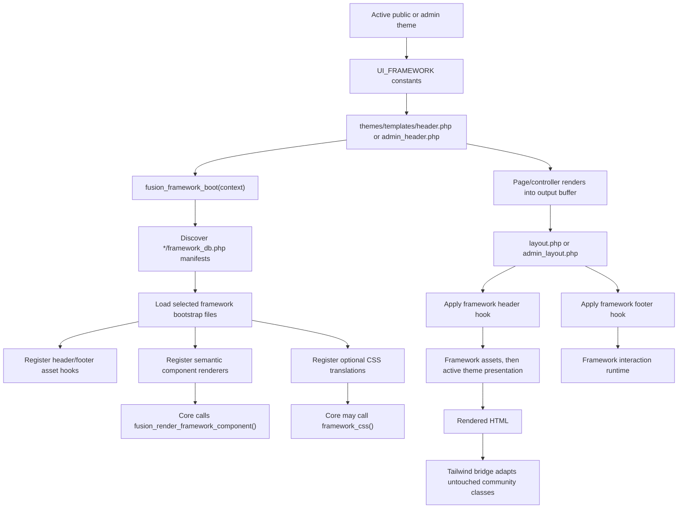

# PHPFusion UI Framework Engine

This is the master, source-grounded reference for PHPFusion's UI framework engine. It documents framework selection, discovery, bootstrapping, assets, component rendering, CSS translation, the Tailwind community bridge, extension procedures, debugging, validation, and current limitations.

Read this document before changing anything under `includes/frameworks/`, changing a theme's framework constants, adding a shared renderer, or altering compatibility for Bootstrap, Tabler, Tailwind, Bulma, Foundation, or custom markup.

The narrower browser-adapter reference is `documentation/framework-bridge/README.md`.

## 1. Scope and design contract

The engine lets a public or administration theme select one structural UI runtime while core callers use stable PHP APIs.

It has four responsibilities:

1. discover and boot the framework requested by the active theme;
2. load that framework's assets through header and footer hooks;
3. dispatch shared semantic components to framework-owned PHP renderers;
4. translate known Bootstrap/Tabler class vocabulary when Tailwind is active.

The active theme remains responsible for final presentation. Framework CSS provides structure and behavior; theme CSS supplies or overrides semantic `--ui-*`, `--ds-*`, `--tblr-*`, or Bootstrap roles.

Non-negotiable rules:

- Only one framework boots during a request.
- Community-authored classes are preserved.
- Unknown classes are preserved.
- `framework_css()` is optional for community markup.
- The Tailwind browser bridge uses DOM tokens and `classList`, never a full-response HTML regex rewrite.
- Browser behavior remains dependency-free when Tailwind is selected.
- Framework component files stay within the selected framework directory.
- Tailwind uses the `tw-` prefix and semantic `--ui-*` roles.
- Generated CSS is never edited directly.

## 2. End-to-end architecture



The early boot in `header.php` and `admin_header.php` is intentional: page controllers render before the final layout, so shared component renderers must already be registered. The later call in `layout.php` or `admin_layout.php` is harmless because booting is idempotent within the request.

## 3. Canonical file map

| Responsibility | Current source |
|---|---|
| Discovery, selection, boot, component registry | `includes/frameworks/framework_engine.php` |
| CSS translation registry and `framework_css()` | `includes/frameworks/framework_css.php` |
| Package-level orientation | `includes/frameworks/README.md` |
| Public early boot | `themes/templates/header.php` |
| Administration early boot | `themes/templates/admin_header.php` |
| AJAX theme and framework boot | `themes/templates/ajax_header.php` |
| Public asset-hook execution | `themes/templates/layout.php` |
| Administration asset-hook execution | `themes/templates/admin_layout.php` |
| Legacy component dispatch compatibility | `includes/deprecated.php` |
| Bootstrap manifest | `includes/frameworks/bootstrap/framework_db.php` |
| Bootstrap loader and component registration | `includes/frameworks/bootstrap/bootstrap_framework.php` |
| Bootstrap 5 asset hooks | `includes/frameworks/bootstrap/v5/index.php` |
| Bootstrap PHP renderers | `includes/frameworks/bootstrap/v5/templates/` |
| Tabler assets and adapter | `includes/frameworks/bootstrap/tabler/` |
| Tailwind manifest | `includes/frameworks/tailwind/framework_db.php` |
| Tailwind loader and component registration | `includes/frameworks/tailwind/tailwind_framework.php` |
| Tailwind PHP class map | `includes/frameworks/tailwind/tailwind_css.php` |
| Tailwind browser bridge | `includes/frameworks/tailwind/tailwind.js` |
| Tailwind source CSS | `includes/frameworks/tailwind/tailwind.input.css` |
| Tailwind build configuration and safelist | `includes/frameworks/tailwind/tailwind.config.js` |
| Generated Tailwind framework bundle | `includes/frameworks/tailwind/tailwind.css` |
| Tailwind PHP renderers | `includes/frameworks/tailwind/templates/` |
| Mapping/component contract test | `tests/framework_css_contract.php` |
| Browser fixture | `tests/fixtures/framework_bridge.html` |
| Browser bridge details | `documentation/framework-bridge/README.md` |
| Agent operating procedure | `.agents/skills/phpfusion-framework/SKILL.md` |

## 4. Framework selection

Themes declare their selection before the engine boots.

Tailwind example:

```php
const UI_FRAMEWORK = 'tailwind';
```

Bootstrap with the project-owned Tabler presentation variant:

```php
const UI_FRAMEWORK = 'bootstrap';
const UI_FRAMEWORK_VERSION = '5';
const UI_FRAMEWORK_VARIANT = 'tabler';
```

`fusion_framework_requested()` resolves selection in this exact priority:

1. `UI_FRAMEWORK`;
2. legacy `THEME_FRAMEWORK`;
3. legacy truthy `BOOTSTRAP`, which resolves to `bootstrap`;
4. no selection, returning `NULL`.

The value must match `^[a-z0-9][a-z0-9_-]*$`. Invalid values are rejected. The engine does not silently load Bootstrap assets when selection is missing or invalid.

Current theme declarations:

| Theme | Framework | Version | Variant |
|---|---|---:|---|
| `themes/Magazine/theme.php` | Bootstrap | 5 | Tabler |
| `themes/admin_themes/EliteAdmin/acp_theme.php` | Bootstrap | 5 | Tabler |
| `themes/admin_themes/Jupiter/acp_theme.php` | Tailwind | framework manifest version | none |

Public and administration themes can therefore use different frameworks on different requests. They cannot switch frameworks after the first boot inside one PHP request.

## 5. Manifest discovery and security

`fusion_frameworks()` discovers direct children matching:

```text
includes/frameworks/*/framework_db.php
```

Each manifest executes inside an isolated closure and may set:

```php
$framework_key = 'example';
$framework_name = 'Example';
$framework_description = 'Example framework translator.';
$framework_version = '1.00.00';
$framework_files = [
    'example_framework.php',
];
```

Discovery adds `key` and `directory` to the returned metadata. Manifests are sorted by path before loading. Invalid keys are skipped.

During boot, every declared file is resolved with `realpath()`. It is loaded only when it exists and remains beneath the selected framework directory. This prevents manifest entries from escaping their package with `../` traversal.

Discovery is cached in a function-static array for the rest of the request. Adding a manifest on disk does not affect a PHP request already in progress.

## 6. Boot lifecycle and request contexts

`fusion_framework_boot(string $context = 'site')`:

1. returns the existing active metadata if already booted;
2. resolves the requested key;
3. discovers available manifests;
4. returns `NULL` if the request is missing or unknown;
5. loads the selected manifest's files in declared order;
6. stores metadata plus `context` in `$GLOBALS['fusion_framework_active']`;
7. returns that active metadata.

The first call wins. A later call with a different context does not reboot or change the active framework.

### Public requests

`themes/templates/header.php` loads the active public theme, boots with `site`, loads shared theme functions, and starts output buffering. `themes/templates/layout.php` calls boot again defensively, then applies `fusion_framework_header` and `fusion_framework_footer` while producing the final document.

### Administration requests

`themes/templates/admin_header.php` validates and loads the selected administration theme, boots with `admin`, loads shared functions, and starts buffering. `themes/templates/admin_layout.php` later applies the framework asset hooks around the administration shell.

### AJAX fragments

`themes/templates/ajax_header.php` accepts `AJAX_THEME_CONTEXT` as `site` or `admin`, resolves and validates the relevant theme when it has not already been loaded, boots the framework, and initializes Dynamics.

AJAX fragment boot registers renderers but does not emit a complete document or framework assets. It assumes the fragment is inserted into a parent page that already loaded the selected framework. A standalone endpoint needing its own page must use the normal layout path.

## 7. Asset lifecycle and ordering

Framework bootstrap files register callbacks with:

```php
fusion_add_hook('fusion_framework_header', 'callback', 10, [], 1);
fusion_add_hook('fusion_framework_footer', 'callback', 10, [], 1);
```

Both hooks receive the request context (`site` or `admin`). A new framework should accept that argument even when its first implementation does not branch on it.

### Public ordering

The public layout emits, in simplified order:

1. default PHPFusion CSS;
2. `fusion_framework_header` assets;
3. core registered styles;
4. active-theme registered styles;
5. head tags, jQuery, and core JavaScript;
6. rendered body;
7. `fusion_framework_footer` assets;
8. notification, footer, jQuery, and inline JavaScript queues.

### Administration ordering

The administration layout emits, in simplified order:

1. default PHPFusion CSS and icon font;
2. core and theme registered styles;
3. shared head tags and core JavaScript;
4. `fusion_framework_header` assets;
5. the administration theme's compiled CSS;
6. rendered administration body;
7. `fusion_framework_footer` assets;
8. footer and jQuery queues.

The administration theme stylesheet intentionally follows the framework stylesheet, allowing it to provide final presentation overrides.

### Bootstrap 5

Standard Bootstrap header assets:

- `bootstrap.min.css`;
- `bootstrap.rtl.min.css` additionally when the locale is RTL.

Standard footer assets:

- `dynamics.min.js`;
- `popper.min.js`;
- `bootstrap.bundle.min.js`.

### Tabler variant

Tabler is selected as a Bootstrap variant, not as a separate manifest.

Header assets:

- `tabler.min.css`;
- Tabler icon webfont CSS.

Footer assets:

- `dynamics.min.js`;
- `tabler.min.js`;
- `tabler-adapter.js`.

The adapter exposes `window.bootstrap` from Tabler when available and preserves the Select2 focus compatibility exception. The Bootstrap loader also registers Tabler's SVG registry when this variant is selected.

### Tailwind

Header assets:

- generated `tailwind.css` with a `filemtime()` cache-busting query;
- deferred `tailwind.js` with a `filemtime()` cache-busting query.

Tailwind currently registers no footer hook because its script is loaded deferred from the header.

## 8. Framework-neutral component registry

Framework loaders register semantic renderers with:

```php
fusion_register_framework_components('tailwind', [
    'modal' => [
        'file' => __DIR__.'/templates/components.tpl.php',
        'callback' => 'tailwind_render_modal',
    ],
]);
```

Registration is ignored when the framework key does not match the active or requested framework. Definitions are stored by component name in `$GLOBALS['fusion_framework_components']`.

Callers render through:

```php
$html = fusion_render_framework_component('modal', $info);
```

Dispatch behavior:

1. missing or malformed definitions return an empty string;
2. a non-empty `file` is resolved with `realpath()`;
3. the file must remain beneath the active framework directory;
4. the file is required once;
5. `_framework_component` is added to the information array;
6. the callback is invoked when callable;
7. missing callbacks return an empty string.

Core helpers generally treat an empty result as a signal to use their legacy server-rendered fallback. That fallback is part of progressive compatibility and must not be removed without tracing every caller.

The deprecated two-argument form `fusion_get_template($component, $info)` delegates to the same registry. Its one-argument form still includes a literal file and captures its output; do not use that legacy form for new component work.

### Registered component matrix

| Semantic key | Main caller | Bootstrap renderer | Tailwind renderer | Notes |
|---|---|---|---|---|
| `showsublinks` | `PHPFusion\SiteLinks` | `navbar.tpl.php` | `components.tpl.php` | Navigation shell and items |
| `form_inputs` | Dynamics | `dynamics-ui.tpl.php` | `components.tpl.php` | Dispatches individual field types |
| `alert` | `alert()` | configured as `components.tpl.php` | `components.tpl.php` | Bootstrap target file is currently absent; caller fallback remains active |
| `badge` | `label()`, `badge()` | configured as `components.tpl.php` | `components.tpl.php` | Bootstrap target file is currently absent; caller fallback remains active |
| `progress` | progress helper | configured as `components.tpl.php` | `components.tpl.php` | Bootstrap target file is currently absent; caller fallback remains active |
| `collapse` | collapse helpers | `collapse.tpl.php` | `components.tpl.php` | Multi-call open/body/close protocol |
| `tabs` | tab helpers | `tabs.tpl.php` | `components.tpl.php` | Multi-call header/panel/footer protocol |
| `modal` | modal helpers | `modal.tpl.php` | `components.tpl.php` | Open/footer/close protocol |
| `notices` | `rendernotices()` | `notices.tpl.php` | `components.tpl.php` | Notice collection renderer |
| `breadcrumbs` | breadcrumb helper | `breadcrumbs.tpl.php` | `breadcrumbs.tpl.php` | Semantic breadcrumb renderer |
| `openside`, `closeside` | Jupiter admin components | not registered | `components.tpl.php` | Tailwind administration surface |
| `opengrid`, `closegrid` | Jupiter admin components | not registered | `components.tpl.php` | Tailwind administration surface |

Jupiter also requests `opentable` and `closetable`; because the shared Tailwind registry does not currently provide them, Jupiter uses its theme-owned fallback renderer.

## 9. CSS translation API

`fusion_register_framework_css($framework, $utilities)` merges a framework-owned token map. Invalid framework keys are ignored.

`framework_css(string|array $classes)`:

1. accepts one string or an array of class lists;
2. splits each list on whitespace;
3. selects the active framework, then the requested framework, then `bootstrap` as the identity fallback;
4. replaces only tokens present in that framework's map;
5. preserves unknown tokens;
6. expands mappings containing multiple target classes;
7. removes duplicate output classes while retaining first appearance order;
8. returns one normalized class string.

Bootstrap and Tabler are the canonical source vocabulary, so Bootstrap normally needs no identity map. Tailwind registers `tailwind_css.php` during boot.

Use `framework_css()` when a core-owned renderer benefits from server-side translation or no-JavaScript structural output. Do not require community templates to wrap every class. Untouched markup is handled by the Tailwind browser bridge.

## 10. Tailwind build and styling architecture

The Tailwind framework has four coordinated source surfaces:

| Surface | Purpose |
|---|---|
| `tailwind.js` | Runtime DOM aliases and interactions |
| `tailwind_css.php` | Optional server-side token translation |
| `tailwind.config.js` | Content discovery, prefix, breakpoints, semantic colors, dynamic safelist |
| `tailwind.input.css` | Grid fallbacks, canonical components, and custom utilities |

`tailwind.css` is generated output.

The input begins with:

```css
@tailwind base;
@tailwind components;
@tailwind utilities;
```

Canonical components live in `@layer components`; custom utility aliases live in `@layer utilities`. All project-owned Tailwind classes use `tw-`.

The configured responsive breakpoints match Bootstrap and Tabler:

| Variant | Minimum width |
|---|---:|
| `sm` | 576px |
| `md` | 768px |
| `lg` | 992px |
| `xl` | 1200px |
| `2xl` (source `xxl`) | 1400px |

Dynamic classes assembled in JavaScript or PHP cannot be reliably discovered by Tailwind's source scanner. Every possible generated target must therefore be enumerated in `safelist`.

Build with:

```powershell
npm.cmd run build:tailwind:framework
```

Watch with:

```powershell
npm.cmd run watch:tailwind:framework
```

## 11. Tailwind community class bridge

The browser bridge preserves existing Bootstrap/Tabler, Bulma, Foundation, and custom classes while adding canonical aliases.

Example input:

```html
<div class="ms-auto d-flex gap-2">...</div>
```

Runtime result:

```html
<div class="ms-auto d-flex gap-2 tw-ms-auto tw-flex tw-gap-2">...</div>
```

### Alias resolution

- `builtinAliases` handles direct one-token mappings.
- `resolveContextualAliases()` parses responsive columns, framework-specific fractions, spacing, negative values, breakpoints, and other patterned utilities.
- `adapterProfiles` holds built-in and project-registered adapters.
- Unknown source tokens are ignored by the resolver and remain on the element.

Each adapted element stores its source signature and the aliases owned by the bridge. When source classes change, stale bridge-owned aliases are removed and recalculated.

### Dynamic DOM behavior

The initial pass visits elements with classes and native selects. A batched `MutationObserver` processes only added subtrees and changed class attributes. Bridge-owned `tw-*` and negative Tailwind classes are excluded from source signatures to prevent adaptation loops.

Public API:

```js
window.FusionUI.registerAdapter(name, definition);
window.FusionUI.adapt(root);
```

Registering an adapter refreshes the document. `adapt(root)` can explicitly refresh a fragment, although normal inserted markup is already observed.

### Interaction behavior

The same dependency-free script handles delegated contracts for:

- dropdowns;
- modals and Foundation reveals;
- collapses;
- tabs and pills;
- offcanvas panels;
- alerts and notices;
- toasts;
- PHPFusion responsive menus.

It recognizes Bootstrap 5 `data-bs-*`, Bootstrap 3/4 `data-*`, common Foundation attributes, and PHPFusion `data-fusion-*`/`data-tailwind-*` contracts. It maintains ARIA state, outside-click behavior, Escape dismissal, modal focus containment and focus return, tab keyboard navigation, and compatible `shown.bs.*`/`hidden.bs.*` events.

A limited `window.bootstrap` facade exposes `Modal`, `Tab`, `Dropdown`, `Toast`, and `Offcanvas` classes for existing programmatic callers. This is a compatibility surface, not a complete Bootstrap JavaScript reimplementation.

See `documentation/framework-bridge/README.md` for the class-maintenance procedure and author contract.

## 12. Extension playbooks

### Add a new framework

1. Create `includes/frameworks/{key}/framework_db.php` with valid metadata and ordered bootstrap files.
2. Create the bootstrap file with `defined('IN_FUSION') || exit;`.
3. Register header and footer asset hooks. Accept the context argument.
4. Implement the complete shared component set needed by core callers.
5. Register renderers with `fusion_register_framework_components()`.
6. Register a CSS map only when Bootstrap/Tabler vocabulary needs translation.
7. Keep every renderer file inside the framework directory.
8. Add a theme declaration using the new key.
9. Test site, administration, and AJAX boot independently.
10. Add discovery, component, path-boundary, asset, fallback, and identity/translation contracts.
11. Document unsupported semantic components explicitly.

Do not add special cases for a new framework to core callers when the registry can express the difference.

### Add or change a semantic component

1. Trace every public helper and direct caller using that semantic key.
2. Record the complete `$info` contract, including multi-call open/close protocols.
3. Implement equivalent Bootstrap and Tailwind renderers or document a deliberate fallback.
4. Escape dynamic values and preserve ARIA relationships.
5. Register the component in each framework loader.
6. Keep component structure semantic and presentation theme-owned.
7. Test successful dispatch and the empty-renderer fallback.
8. Test keyboard behavior and all default, empty, error, disabled, and destructive states that apply.

### Add a missed Bootstrap or Tabler class

Follow `documentation/framework-bridge/README.md#adding-or-changing-compatibility`. The required parity surfaces are:

1. `tailwind.js` browser alias or patterned parser;
2. `tailwind_css.php` optional server mapping;
3. `tailwind.config.js` safelist for generated targets;
4. `tailwind.input.css` when custom source CSS is required;
5. `tests/framework_css_contract.php` and the browser fixture.

### Add a browser interaction

1. Trace the source framework's markup, targets, state classes, methods, events, keyboard behavior, focus behavior, and dismissal rules.
2. Use the existing delegated document listeners.
3. Resolve targets through the shared target helper.
4. Preserve source state classes while adding canonical states.
5. Maintain ARIA and dispatch compatibility events.
6. Extend the facade only when real programmatic callers need it.
7. Test initial and dynamically inserted markup, mouse, keyboard, Escape, outside click, and focus return.

### Integrate a theme

1. Declare the framework constants before header boot.
2. Do not load duplicate framework assets from the theme.
3. Define semantic theme variables and presentation overrides.
4. Keep the theme stylesheet after framework structural CSS.
5. Render shared components through the registry or existing PHPFusion helpers.
6. Verify public/admin direction, responsive breakpoints, dark mode, and reduced motion.

## 13. Debugging decision tree

### No framework assets load

Check, in order:

1. the active theme file was loaded before boot;
2. `UI_FRAMEWORK` contains the intended valid key;
3. `fusion_framework_requested()` returns that key;
4. `fusion_frameworks()` discovers its manifest;
5. manifest files exist beneath the package directory;
6. `fusion_framework_active()` is populated;
7. the layout applies the matching header/footer hooks;
8. no earlier boot selected another framework.

### A component returns an empty string

Check:

1. the framework booted before the caller rendered;
2. the component key was registered;
3. its file exists and resolves beneath the active framework directory;
4. the file defines the named callback;
5. the callback is callable and returns markup;
6. the caller retains a safe fallback.

### `framework_css()` does not translate a class

Check:

1. the active/requested framework is Tailwind;
2. `tailwind_css.php` was registered during boot;
3. the exact source token exists in the PHP map;
4. patterned JS support has an equivalent PHP-generated entry;
5. unknown-token preservation is not being mistaken for failed loading.

### The browser adds no alias

Check:

1. `tailwind.js` loaded without syntax or console errors;
2. the source class remains on the element;
3. the token exists in `builtinAliases` or matches the contextual parser;
4. the element was present initially or inserted beneath the observed document;
5. another script did not replace the element after adaptation.

### The alias exists but has no visible effect

Check:

1. the complete target exists in compiled `tailwind.css`;
2. interpolated targets are safelisted;
3. responsive variants are tested above their Bootstrap/Tabler breakpoint;
4. negative prefix syntax is correct;
5. the target does not collide with a canonical component;
6. active-theme CSS specificity or load order is not overriding structure;
7. the source framework's numeric value was translated by computed value, not suffix.

### AJAX markup differs from full-page markup

Check:

1. `AJAX_THEME_CONTEXT` is correct;
2. the same theme constants resolve in both paths;
3. the parent document already loaded the framework assets;
4. Dynamics was initialized;
5. the inserted fragment is adapted by the observer.

## 14. Validation matrix

Use checks proportional to the changed layer.

| Change | Required validation |
|---|---|
| Engine, manifest, loader, or PHP map | `php -l` on every changed PHP file; targeted boot/registry contract |
| Tailwind JavaScript | `node --check`; browser initial and dynamic DOM checks |
| Tailwind CSS/config | rebuild; compiled-selector assertions; responsive browser check |
| Component renderer | PHP contract; escaping and ARIA inspection; browser interaction where applicable |
| Theme selection/assets | public, admin, and AJAX request inspection; verify asset order and duplication |
| Documentation/skill only | focused source review and `git diff --check` |

Canonical commands:

```powershell
npm.cmd run build:tailwind:framework
php tests/framework_css_contract.php
node --check includes/frameworks/tailwind/tailwind.js
php -l includes/frameworks/framework_engine.php
php -l includes/frameworks/framework_css.php
php -l includes/frameworks/bootstrap/bootstrap_framework.php
php -l includes/frameworks/tailwind/tailwind_framework.php
php -l includes/frameworks/tailwind/tailwind_css.php
git diff --check -- includes/frameworks themes/templates tests/framework_css_contract.php tests/fixtures/framework_bridge.html documentation .agents/skills/phpfusion-framework
```

Browser validation should cover 375px, 768px, 1024px, and 1440px; keyboard access; focus-visible; reduced motion; initial and dynamically inserted markup; and open/close state restoration.

## 15. Current known limits

These are verified boundaries of the current checkout:

- Only Bootstrap `v5/` assets and templates exist even though `get_bootstrap()` clamps numeric versions from 3 through 5. Themes must select version 5 unless older packages are restored.
- Bootstrap registers `alert`, `badge`, and `progress` against `v5/templates/components.tpl.php`, but that file is absent. Current core callers fall back to their legacy Bootstrap markup when dispatch returns an empty string.
- Jupiter requests `opentable` and `closetable`, but the shared Tailwind registry does not register them; Jupiter intentionally uses its theme fallback.
- AJAX fragment bootstrap registers renderers but does not output assets.
- The engine has no automatic framework fallback when a requested manifest is absent.
- Boot state is process-request local and first-call-wins; runtime switching is unsupported.
- The Tailwind bridge covers the documented compatibility surface, not arbitrary Bootstrap, Tabler, Bulma, or Foundation plugins.
- Bootstrap/Tabler class-name collisions with different computed values require a documented project choice.
- Static and browser checks do not replace inspecting the real active theme where cascade and asset ordering matter.

Do not silently "fix" a known limit while performing unrelated work. Turn it into an explicit scoped change with its own contract coverage.

## 16. Completion checklist

- [ ] Active theme and request context traced.
- [ ] Selected constants and manifest verified.
- [ ] Boot, hook, and asset order verified.
- [ ] Component registration and fallback path traced.
- [ ] Browser and PHP class translation kept in parity.
- [ ] Unknown and source classes preserved.
- [ ] Dynamic Tailwind targets safelisted.
- [ ] Semantic tokens and theme ownership preserved.
- [ ] Source assets rebuilt; generated files not hand-edited.
- [ ] Public, administration, and AJAX effects considered.
- [ ] Contract, syntax, compiled-selector, browser, breakpoint, and diff checks completed as applicable.
- [ ] Known limitations and deliberate fallbacks documented.
