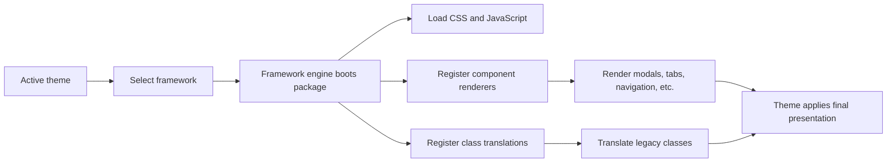

# Understanding the PHPFusion UI Framework Engine

The PHPFusion UI Framework Engine is an abstraction layer that allows a theme to select a UI framework—such as Bootstrap, Tabler, or Tailwind—while PHPFusion continues to use stable, framework-neutral PHP APIs.

In simple terms, it acts as a **loader, dispatcher, and compatibility bridge** between PHPFusion, the selected UI framework, and the active theme.



## 1. Framework selection

A theme declares its framework before the page header is loaded.

### Bootstrap with the Tabler variant

```php
const UI_FRAMEWORK = 'bootstrap';
const UI_FRAMEWORK_VERSION = '5';
const UI_FRAMEWORK_VARIANT = 'tabler';
```

### Tailwind

```php
const UI_FRAMEWORK = 'tailwind';
```

The engine resolves the requested framework in this order:

1. `UI_FRAMEWORK`
2. Legacy `THEME_FRAMEWORK`
3. Legacy `BOOTSTRAP`
4. No framework

Only one framework can be active during a PHP request. The first successful call to the framework boot process wins.

Public and administration themes can select different frameworks because they run in separate requests.

## 2. Framework packages

Framework packages live under:

```text
includes/frameworks/
```

A simplified directory structure looks like this:

```text
includes/frameworks/
├── framework_engine.php
├── framework_css.php
├── bootstrap/
│   ├── framework_db.php
│   ├── bootstrap_framework.php
│   └── v5/
└── tailwind/
    ├── framework_db.php
    ├── tailwind_framework.php
    ├── tailwind_css.php
    ├── tailwind.js
    └── templates/
```

Each framework is a self-contained package with its own:

- Manifest
- Bootstrap loader
- CSS and JavaScript assets
- Semantic component renderers
- Optional CSS class translation map
- Optional browser compatibility layer

## 3. Manifest discovery

Every framework package contains a `framework_db.php` manifest.

For example:

```php
$framework_key = 'tailwind';
$framework_name = 'Tailwind';
$framework_description = 'Tailwind UI framework support.';
$framework_version = '1.00.00';

$framework_files = [
    'tailwind_framework.php',
];
```

The engine discovers manifests matching:

```text
includes/frameworks/*/framework_db.php
```

The main lifecycle functions are:

```php
fusion_framework_requested();
fusion_frameworks();
fusion_framework_boot();
fusion_framework_active();
```

Their responsibilities are:

| Function | Responsibility |
|---|---|
| `fusion_framework_requested()` | Determines which framework the theme requested |
| `fusion_frameworks()` | Discovers available framework packages |
| `fusion_framework_boot()` | Loads the selected framework |
| `fusion_framework_active()` | Returns the active framework metadata |

Manifest files are security-checked using resolved filesystem paths. A manifest cannot use paths such as `../` to load PHP files outside its own package directory.

## 4. Framework boot lifecycle

The framework is booted early in the request.

Typical entry points include:

```text
themes/templates/header.php
themes/templates/admin_header.php
themes/templates/ajax_header.php
```

Early booting is important because page controllers may render shared UI components before the final layout is produced.

A simplified request flow is:

```text
Theme loads
    ↓
Theme declares UI_FRAMEWORK
    ↓
Header calls fusion_framework_boot()
    ↓
Framework registers assets and renderers
    ↓
Controller renders page content
    ↓
Layout executes framework hooks
    ↓
Final document is returned
```

Calling `fusion_framework_boot()` again later is safe. Once a framework is active, subsequent calls return the existing framework metadata instead of booting it again.

### Request contexts

The engine supports three relevant request paths:

- `site` — public-facing pages
- `admin` — administration pages
- AJAX fragments — partial HTML responses

AJAX fragments register framework behavior and renderers but do not output an entire document’s framework assets. They assume the parent page has already loaded the correct framework.

## 5. Asset loading

Frameworks register assets through framework-specific hooks:

```php
fusion_add_hook(
    'fusion_framework_header',
    'framework_header_callback'
);

fusion_add_hook(
    'fusion_framework_footer',
    'framework_footer_callback'
);
```

The final public or administration layout executes these hooks.

A framework may use the header hook for:

- Structural CSS
- Icon styles
- Deferred browser bridges

The footer hook may load:

- Interaction scripts
- Compatibility adapters
- Supporting JavaScript libraries

The active theme remains the final presentation layer. Framework assets provide structure and behavior, while theme CSS controls product-specific colors, typography, spacing, and decoration.

## 6. Semantic component rendering

Application code should request components by their meaning rather than checking which framework is active.

For example:

```php
$html = fusion_render_framework_component('modal', $info);
```

The active framework registers its implementation:

```php
fusion_register_framework_components('tailwind', [
    'modal' => [
        'file' => __DIR__.'/templates/components.tpl.php',
        'callback' => 'tailwind_render_modal',
    ],
]);
```

Common semantic component keys include:

- `modal`
- `tabs`
- `collapse`
- `alert`
- `badge`
- `progress`
- `breadcrumbs`
- `showsublinks`
- `form_inputs`
- `notices`

This avoids spreading framework checks throughout the application:

```php
// Avoid this approach:

if ($framework === 'tailwind') {
    // Render Tailwind markup.
} else {
    // Render Bootstrap markup.
}
```

Instead, callers provide a stable information structure and the selected framework owns the resulting markup.

### Renderer security

Before executing a renderer, the engine verifies that:

1. The component definition is valid.
2. The renderer file exists.
3. The renderer remains inside the active framework directory.
4. The configured callback is callable.

If any validation fails, the dispatcher returns an empty string.

## 7. Legacy fallbacks

Many PHPFusion helpers treat an empty renderer response as a signal to use their existing server-rendered markup.

```text
Semantic renderer succeeds
    → Use framework-owned markup

Semantic renderer is unavailable
    → Use legacy fallback markup
```

This provides progressive compatibility while components are migrated to the semantic registry.

Fallbacks should not be removed until every caller and supported framework implementation has been traced and verified.

## 8. CSS class translation

PHPFusion and community extensions may contain Bootstrap-style classes such as:

```html
<div class="ms-auto d-flex gap-2">
```

When Tailwind is active, server-rendered code can translate these classes with:

```php
framework_css('ms-auto d-flex gap-2');
```

A possible result is:

```text
tw-ms-auto tw-flex tw-gap-2
```

The `framework_css()` function follows several important rules:

- Known classes are translated.
- Unknown classes are preserved.
- One source class may expand into multiple target classes.
- Duplicate output classes are removed.
- The order of first appearance is preserved.
- Bootstrap vocabulary acts as the default identity vocabulary.

The translation API is optional. Community templates do not need to wrap every class in `framework_css()`.

## 9. Tailwind browser bridge

When Tailwind is selected, the browser bridge can adapt untouched community markup at runtime.

Given this source markup:

```html
<div class="ms-auto d-flex gap-2">
```

The bridge preserves the source classes and adds canonical Tailwind aliases:

```html
<div class="ms-auto d-flex gap-2 tw-ms-auto tw-flex tw-gap-2">
```

Preserving source classes is important for:

- Backward compatibility
- Third-party JavaScript
- Debugging
- Progressive migration
- Framework interoperability

The bridge supports:

- Direct class aliases
- Responsive utility patterns
- Spacing and negative values
- Bootstrap and Tabler vocabulary
- Selected Bulma and Foundation vocabulary
- Dynamically inserted markup
- Project-specific adapters

A `MutationObserver` processes new or modified elements without repeatedly rescanning the entire document.

Projects can also register their own adapters:

```js
window.FusionUI.registerAdapter('project-name', definition);
window.FusionUI.adapt(root);
```

## 10. Browser interactions

The Tailwind bridge also provides dependency-free interaction behavior for common components:

- Dropdowns
- Modals
- Collapses
- Tabs and pills
- Offcanvas panels
- Alerts
- Toasts
- Responsive menus

It recognizes several established data-attribute conventions, including:

- Bootstrap 5 `data-bs-*`
- Legacy Bootstrap `data-*`
- Common Foundation attributes
- PHPFusion `data-fusion-*`
- Tailwind bridge `data-tailwind-*`

The interaction layer maintains important accessibility behavior such as:

- ARIA state updates
- Keyboard navigation
- Escape-key dismissal
- Outside-click dismissal
- Modal focus containment
- Focus restoration
- Compatible shown and hidden events

It also exposes a limited `window.bootstrap` compatibility facade for existing programmatic callers.

This is a compatibility surface, not a complete reimplementation of every Bootstrap or third-party plugin.

## 11. Bootstrap and Tabler

Tabler is treated as a Bootstrap variant rather than a separate framework manifest.

Example:

```php
const UI_FRAMEWORK = 'bootstrap';
const UI_FRAMEWORK_VERSION = '5';
const UI_FRAMEWORK_VARIANT = 'tabler';
```

This allows PHPFusion to retain Bootstrap component semantics while using Tabler’s assets and presentation.

The Tabler integration may provide:

- Tabler CSS
- Tabler icons
- Tabler JavaScript
- A Bootstrap-compatible browser adapter
- Shared PHP component renderers

## 12. Tailwind build architecture

The Tailwind implementation has several coordinated surfaces:

| File | Responsibility |
|---|---|
| `tailwind.js` | Browser aliases and interactions |
| `tailwind_css.php` | Server-side class translation |
| `tailwind.config.js` | Content scanning, prefix, breakpoints, and safelist |
| `tailwind.input.less` | Tailwind directives and component source |
| `tailwind.less` | Readable framework LESS source |
| `tailwind.css` | Generated framework bundle |

Project-owned Tailwind classes use the `tw-` prefix.

For example:

```text
tw-flex
tw-gap-2
tw-ms-auto
```

Generated CSS files should not be edited directly. Changes should be made in their source files and then rebuilt.

A typical build command is:

```powershell
npm.cmd run build:tailwind:framework
```

Runtime-generated classes must also be included in the Tailwind safelist because the content scanner cannot reliably discover dynamically constructed class names.

## 13. Responsibility boundaries

The architecture separates ownership clearly:

| Layer | Responsibility |
|---|---|
| Application and core | Request semantic components |
| Framework engine | Select and securely boot one framework |
| Framework package | Supply structure, behavior, assets, and renderers |
| CSS translator | Translate known server-side class vocabulary |
| Browser bridge | Adapt untouched and dynamically inserted markup |
| Active theme | Apply final visual presentation |

This separation means the framework engine is more than a CSS selector.

It coordinates:

- Framework selection
- Secure package discovery
- Request bootstrapping
- Asset ordering
- PHP component rendering
- Legacy fallbacks
- CSS compatibility
- Dynamic DOM adaptation
- Browser interactions
- Accessibility behavior
- Theme presentation overrides

## 14. Adding another framework

A new framework package should:

1. Create `includes/frameworks/{key}/framework_db.php`.
2. Declare a valid and stable framework key.
3. Provide an ordered framework bootstrap file list.
4. Register context-aware header and footer hooks.
5. Implement the semantic components required by core callers.
6. Register component renderer file and callback pairs.
7. Register a CSS translation map only when needed.
8. Keep all renderer files inside the framework package.
9. Add a theme declaration selecting the new framework.
10. Test public, administration, and AJAX request paths.
11. Document unsupported components and deliberate fallbacks.

Framework-specific branches should not be added throughout core helpers when the manifest, component registry, or CSS translator can own the difference.

## 15. Debugging checklist

If framework assets do not load, verify:

1. The active theme loaded before framework boot.
2. `UI_FRAMEWORK` contains a valid key.
3. The corresponding manifest was discovered.
4. Manifest files exist inside the package.
5. The framework became active.
6. The layout executes the framework hooks.
7. Another framework did not boot earlier.

If a component returns an empty string, verify:

1. The framework booted before the component call.
2. The semantic key was registered.
3. The renderer file exists.
4. The file remains inside the framework package.
5. The callback exists and is callable.
6. The callback returns markup.
7. The caller retains a safe fallback.

If class translation appears ineffective, verify:

1. The intended framework is active.
2. The class exists in the translation map.
3. Browser and PHP mappings agree.
4. The target class exists in compiled CSS.
5. Dynamic targets are safelisted.
6. The active theme is not overriding the structural rule.

## Conclusion

The PHPFusion UI Framework Engine allows PHPFusion to support multiple structural UI frameworks without coupling application code to any one framework.

Core code asks for semantic components. The selected framework supplies markup, assets, compatibility mappings, and interactions. The active theme then applies the final visual identity.

This architecture makes it possible to modernize themes, support community extensions, and introduce new UI frameworks while preserving backward compatibility.

## Further reading

- [`documentation/phpfusion/ui-framework-engine.md`](../../documentation/phpfusion/ui-framework-engine.md) — complete source-grounded architecture, lifecycle, extension, debugging, and validation reference
- [`documentation/framework-bridge/README.md`](../../documentation/framework-bridge/README.md) — Tailwind class adapter and interaction contract
